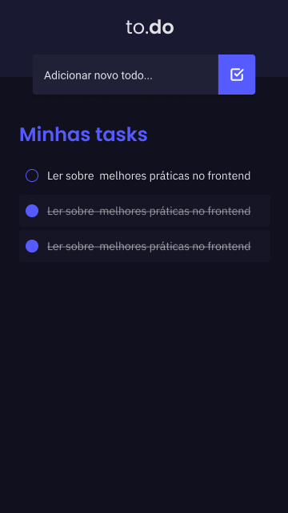

<h1 align="center">
    to.do
</h1>
 <p align="center">Aplicativo para gerenciar tarefas.</p>

<p align="center">
  <a href="https://github.com/daviseares/status-code/commits/master">
    
  </a>

  
</p>

<br>


## 📱  Projeto
to
<p align="center">
  
  
  
</p>

## 🚀  Tecnologias

Entre as tecnologias utilizadas, destaca-se:

- [Styled Components](https://www.typescriptlang.org/)
- [TypeScript](https://www.typescriptlang.org/)
- [React Native v0.64.1](https://facebook.github.io/react-native/)
- [Lodash](https://lodash.com/)
- [MobX](https://mobx.js.org/README.html)
- [Async Storage](https://react-native-async-storage.github.io/async-storage/docs/install/)


### 💻 Installation

```bash
# Clone this repository
$ git clone https://github.com/daviseares/to.do-react-native.git

# Go into the repository
$ cd to.do-react-native

# Install dependencies
$ yarn

# IOS
$ npx pod-install
$ yarn ios

# Android
$ yarn android

```


## 🤔 Como contribuir

- Faça um fork desse repositório;
- Cria uma branch com a sua feature: `git checkout -b minha-feature`;
- Faça commit das suas alterações: `git commit -m 'feat: Minha nova feature'`;
- Faça push para a sua branch: `git push origin minha-feature`.

Depois que o merge da sua pull request for feito, você pode deletar a sua branch.

## :memo: Licença

Esse projeto está sob a licença MIT. Veja o arquivo [LICENSE](LICENSE) para mais detalhes.

---

Feito com ♥ &nbsp;by Davi Borges.

